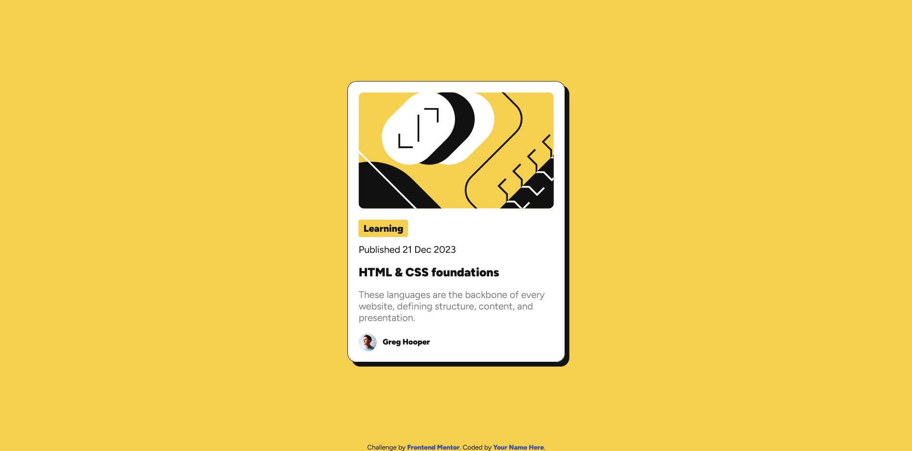

# Frontend Mentor - Blog preview card solution

This is a solution to the [Blog preview card challenge on Frontend Mentor](https://www.frontendmentor.io/challenges/blog-preview-card-ckPaj01IcS). Frontend Mentor challenges help you improve your coding skills by building realistic projects.

## Table of contents

- [Overview](#overview)
  - [Screenshot](#screenshot)
  - [Links](#links)
- [My process](#my-process)
  - [Built with](#built-with)
  - [What I learned](#what-i-learned)
- [Author](#author)

## Overview

This is a simple exercise to build a Blog preview card.

### Screenshot

### Links

- Solution URL: https://github.com/shivani16kulkarni/fem-blog-preview-card
- Live Site URL: https://shivani16kulkarni.github.io/fem-blog-preview-card/

## My process

### Built with

- Semantic HTML5 markup
- CSS custom properties
- Flexbox

### What I learned

I got to practise my CSS Flexbox skills and created a custom button.

## Author

- Frontend Mentor - @shivani16kulkarni, https://www.frontendmentor.io/profile/shivani16kulkarni
